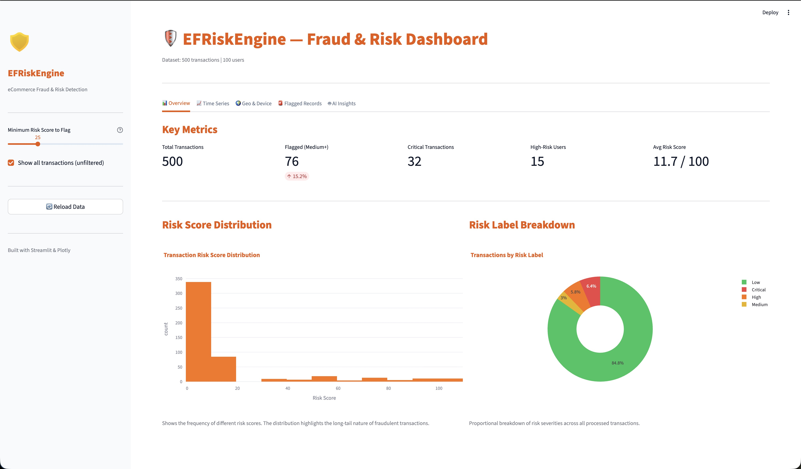
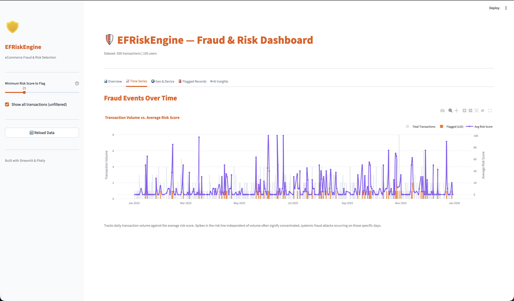
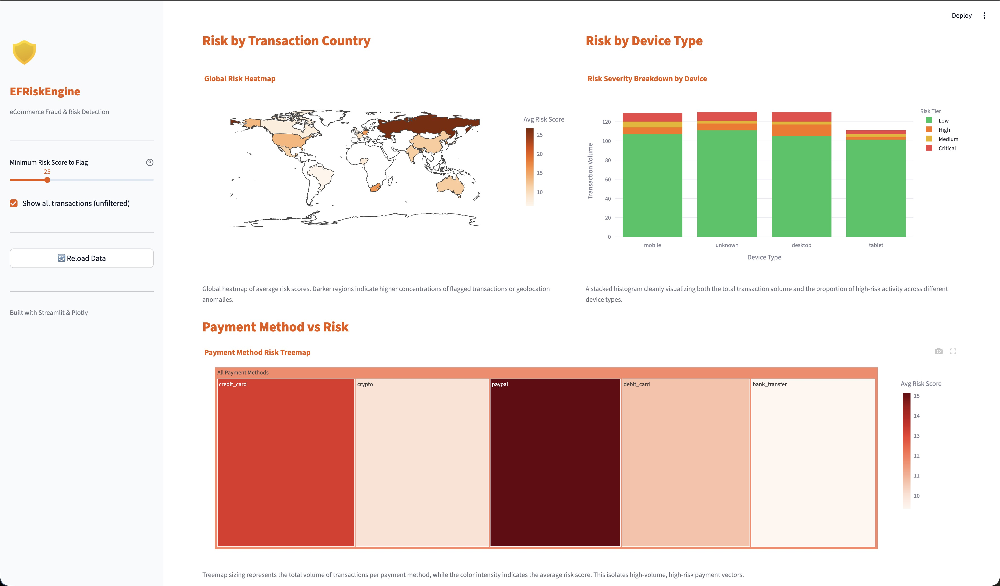
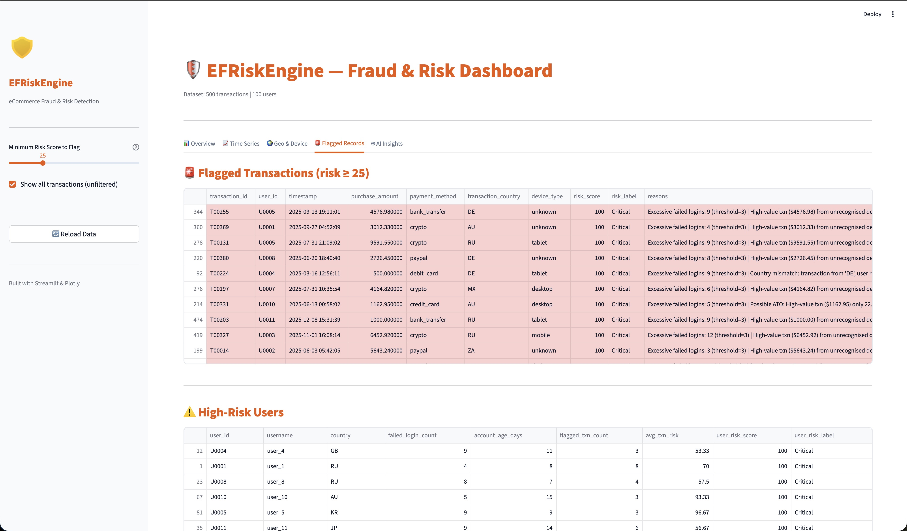
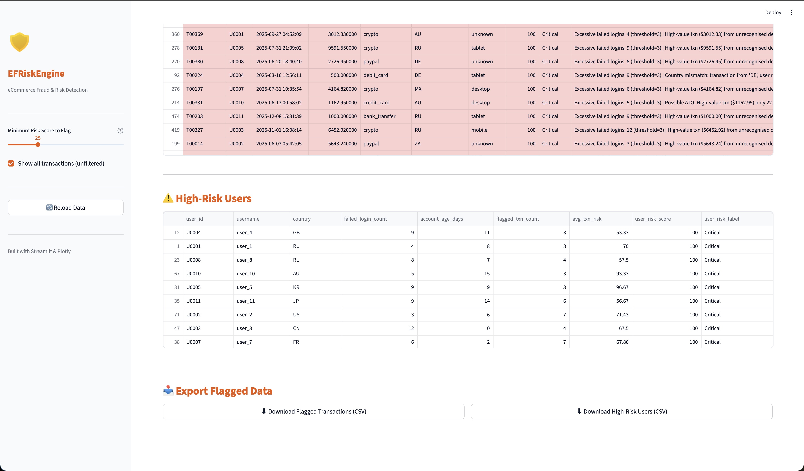
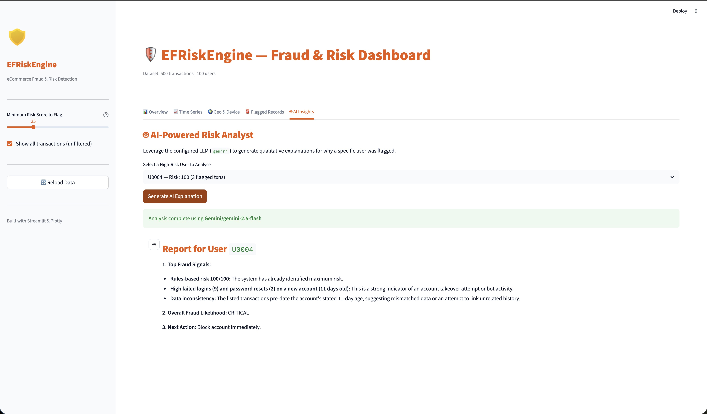
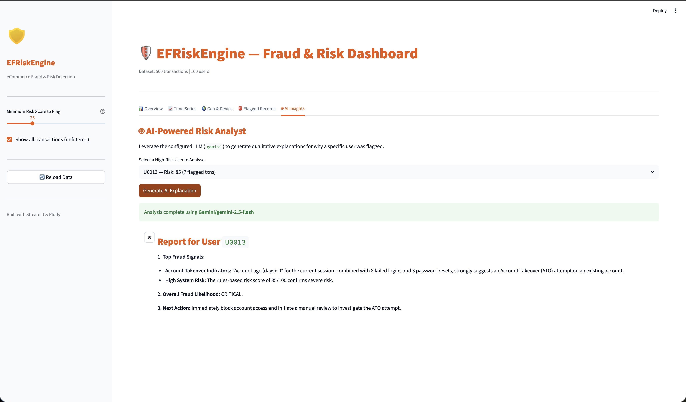

# EFRiskEngine 🛡️

**eCommerce Fraud & Risk Detection AI Platform**

EFRiskEngine is a production-grade Python system that detects, scores, and analyzes fraudulent eCommerce transactions. It combines a highly configurable **rules-based engine**, **Google Gemini AI qualitative analysis**, and a **custom Streamlit data science dashboard** to give fraud analysts a comprehensive view of transaction risk.

Designed to mimic real-world enterprise architectures, this tool identifies adversarial tactics like Account Takeovers (ATO) and simulates threat intelligence integrations to flag high-risk network Activity.

---

## 🛠 Tech Stack & Tools Used

**Core Languages & Frameworks:**
- **Python 3.11+**: Core engine logic, data pipeline, and AI integration.
- **Streamlit**: Interactive web dashboard for data visualization and analyst workflows.
- **Plotly**: Advanced data science visualizations (Choropleth Maps, Treemaps, Dual-Axis Subplots, Stacked Histograms).

**Data Management & Testing:**
- **Pandas / NumPy**: High-performance data manipulation and aggregation.
- **SQLAlchemy / SQLite**: Lightweight relational database for ETL ingestion and normalized data storage.
- **Pytest**: Comprehensive unit testing suite ensuring core logic stability.

**AI & Machine Learning:**
- **Google GenAI SDK (Gemini 2.5 Flash)**: Ingests unstructured transaction histories to provide qualitative risk assessments and plain-English explanations for non-technical stakeholders.

---

## 📊 Dashboard & Features Walkthrough

The Streamlit dashboard empowers analysts to investigate threats holistically. Below is a walkthrough of the platform's core capabilities.

### 1. Executive Overview & Risk Distribution
The Overview tab provides real-time KPIs and a distribution of transaction risks. We utilize a clean histogram to show the long-tail nature of fraudulent activity, moving away from cluttered statistical plots to prioritize immediate readability.



### 2. Time Series & Volume Tracking
This dual-axis subplot tracks daily transaction volume (bars) against the average risk score (line). Spikes in the risk line independent of transaction volume often signify concentrated, systemic fraud attacks occurring on those specific days.



### 3. Geographic Threat Intelligence
To track global threats, EFRiskEngine utilizes a Choropleth World Map indicating Risk by Transaction Country. Darker regions highlight higher concentrations of flagged transactions or geolocation anomalies (e.g., a user's IP originating far from their registered shipping address).

Alongside it sits statistical breakdowns of Risk by Device Type, represented as an easily scannable stacked histogram.



### 4. Payment Method Variance
Moving away from simple averages, the Payment Method analysis utilizes a Data-Dense Treemap. The size of the blocks represents the total volume of transactions per payment method, while the color intensity indicates the average risk score, isolating high-volume, high-risk payment vectors.



### 5. Analyst Investigation Table
The Flagged Records tab serves as the primary workbench for Fraud Analysts. It automatically isolates transactions exceeding the user-defined risk threshold, color-coding them by severity (Yellow for Medium, Orange for High, Red for Critical). 



### 6. High-Risk User Profiling
Below the transaction view, analysts can review aggregate profiles of High-Risk Users. This view aggregates a user's entire history, flagging metrics like excessive failed logins, recent password resets (indicating Account Takeover), and overall transaction risk.



### 7. AI-Powered Insights
To assist junior analysts and non-technical stakeholders, the Gemini AI integration analyzes a user's specific metadata to determine *why* they are risky. The AI can natively understand specific patterns, such as the relationship between a recent password reset and a sudden high-value transaction, identifying it as an Account Takeover.



---

## ⚙️ Advanced Fraud Detection Rules

The rules engine (`src/risk_engine.py`) applies independent signal rules that aggregate into a 0-100 score. The logic specifically includes advanced features mirroring enterprise security standards:

| Rule | Description | Target Tactic |
|------|-------------|---------------|
| **ATO Prevention** | Flags high-value transactions occurring shortly after a password reset. | Account Takeovers |
| **Threat Intelligence** | Heavily penalizes transactions originating from known risky ASNs (Tor nodes, proxy hosts). | Adversary Network Infrastructure |
| **Velocity Spike** | Detects 3+ rapid transactions from a single user within a one-hour window. | Automated Card Testing |
| **Country Mismatch** | Identifies severe discrepancies between a user's transaction IP and registered country. | Geographic Fraud |
| **Bot Behaviour** | Flags unrecognized/bot browser strings combined with round-number purchases. | Automated Scraping/Checkout Bots |
| **Login Anomalies** | Tracks and penalizes excessive failed login attempts across sessions. | Credential Stuffing |

---

## 🚀 Quick Start & Setup

### 1. Environment Setup

```bash
git clone https://github.com/YOUR_USERNAME/eCommerce-Fraud-and-Risk-Detection-tool.git
cd eCommerce-Fraud-and-Risk-Detection-tool

python -m venv .venv
source .venv/bin/activate        # Windows: .venv\Scripts\activate
pip install -r requirements.txt
```

### 2. Configure Credentials
Copy the template to set your environment variables:
```bash
cp .env.example .env
```
Edit `.env` and add your Google Gemini API key. *(Note: The `.env` file is gitignored for security).*

### 3. Generate Mock Data & Run Pipeline
To populate the SQLite database with realistic synthetic fraud data:
```bash
python generate_sample_data.py
```

### 4. Launch the Streamlit Dashboard
```bash
streamlit run dashboards/fraud_dashboard.py
```
The application will launch on `http://localhost:8501`.

---

## 🧪 Running Tests
The project features a full Pytest suite verifying the Risk Engine calculations and Data Pipeline robustness.

```bash
# Run all tests
pytest tests/ -v

# Run with coverage report
pytest tests/ -v --cov=src --cov-report=term-missing
```

---
*Developed with Python 3.11+, Streamlit, Plotly, and Google Gemini AI.*
